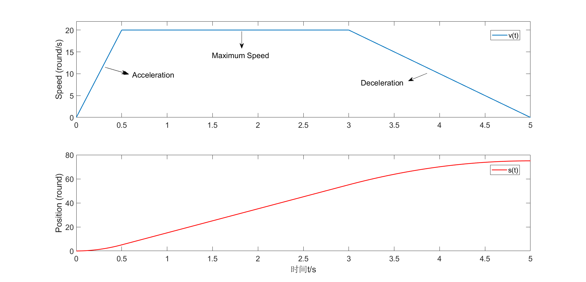
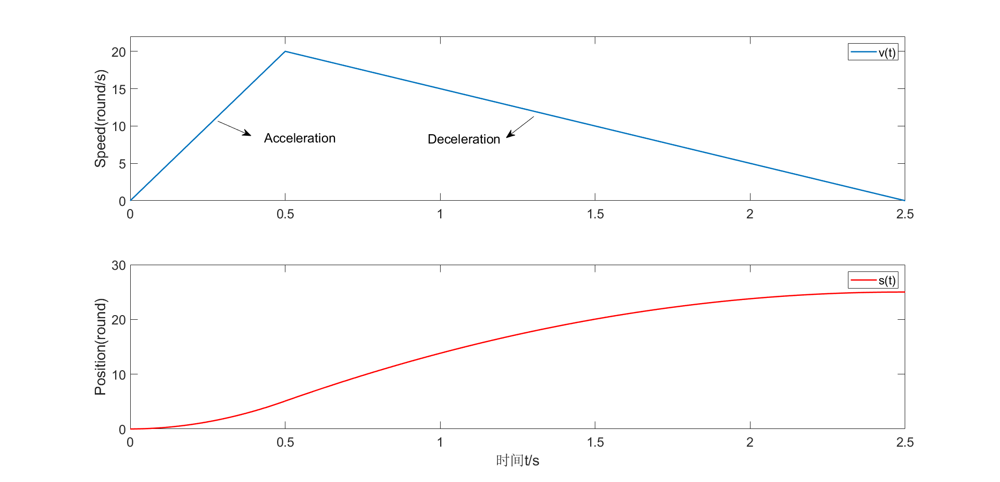
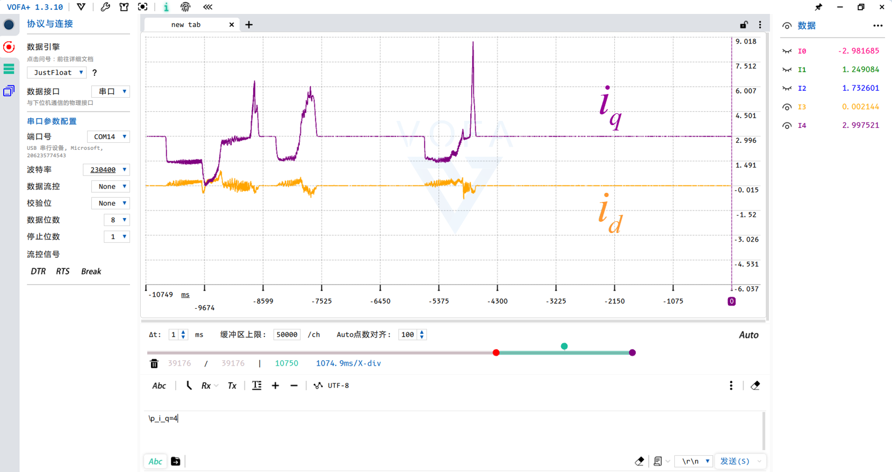

# Vector 驱动器 用户指南

First update:2026.2

Last update:2026.5

## 一、功能介绍

​        Vector 驱动器是一款中小型尺寸，基于矢量控制的永磁同步电机驱动，适用于轮毂电机，关节电机等。24V母线电压下，实测最高支持约400W的持续功率输入（需散热片）。内部算法可实现基础的电流，速度，位置闭环，同时具有一定的参数辨识能力。目前仅支持有感运行，板载了一块TLE5012B绝对式编码器，同时支持外部SPI编码器信号输入。通信外设提供了USB，UART，FDCAN三种，USB和FDCAN具备自主控制协议，USB FS 波特率12Mbps，可以通过VOFA+上位机以字符串的形式向下位机发送指令，即插即用。FDCAN数据段最高波特率5Mbps，可通过外部主控向总线发送报文以实现一对多控制。驱动器具有母线过压和欠压，相线过流，过温等保护，最大程度地保障驱动能够稳定运行。

### 1.已有功能

* 基础有感FOC算法 电流 速度 位置 可控
* 位置控制梯形速度轨迹规划
* 磁编码器偏心补偿
* 电机相电阻+dq轴电感+永磁体磁链辨识
* FDCAN通信控制+超时保护
* USB通信控制
* 支持绝对式SPI编码器 TLE5012B，MT6816, MT6701
* 过压、欠压、过流、过温保护
* 编码器断连识别

### 2.注意事项

> MCU的PB8引脚为BOOT0引脚，在设计时由于引脚紧张复用成FDCAN1_RX，让程序正常启动需要使用STM32CubeProgrammer将BOOT0软件下拉。

> 驱动供电电压为**13V-30V**，外部电源超过35V运行可能会引发器件过压损坏。

> 请按照说明完成各项参数的配置及校准，错误设置将会导致电机不正常运行。

## 二、硬件设计

### 1.元件选型

* MCU : **STM32G431CBU6**
* 栅极驱动 : **FD6288Q**
* MOSFET : **CSD18540Q5B** 
* 采样电阻 : **2mΩ** **2512封装**
* 电流感应放大器 : **RS721XF**
* 采样方案：**三电阻低侧采样**

### 2.整体布局

<center class="half">
    
</center>


<div align="center">图2-1 驱动器布局示意图


## 三、软件设置

### 1.参数定义

|   名称   |   解释   |    范围     | CAN参数ID | USB参数ID | 默认值 |
| :------: | :------: | :---------: | :----: | :------: | :------: |
| mode | 运行模式 | [0,10] (int) |  0x00  |  mod  |    |
|  i_set   | 设定电流 |   [-i_lim,i_lim]   |  0x02  |  i_s  |    |
| spd_set  | 设定速度 |  [-spd_lim,spd_lim]  |  0x04  |  s_s  |    |
| pos_set  | 设定位置 |     [-$\infty$,+$\infty$]     | 0x06 | p_s |  |
| **can_id** | CAN节点ID | [0,7] (int) | 0x08 | cid | 0 |
| **pol** | 极对数 | [2,30] (int) | 0x0A | pol | 0 |
| **enc_state** | 编码器状态 | 特定值 | 0x0C | e_s | 1 |
| **i_cal** | 校准电流 | [5,30] | 0x0E | ica | 10 |
| **i_lim** | 最大电流限制 | [0,60] | 0x10 | ilm | 30 |
| **spd_lim** | 最大速度限制 | [0,400] | 0x12 | slm | 200 |
| **spd_acc** | 速度环加速度 | [0,1000] | 0x14 | sac | 50 |
| **spd_dec** | 速度环减速度 | [0,1000] | 0x16 | sde | 50 |
| **spd_kp** | 速度环比例P | [0.01,2] | 0x18 | s_p | 0.05 |
| **spd_ki** | 速度环积分I | [0,2] | 0x1A | s_i | 0.5 |
| **pos_acc** | 位置环加速度 | [0,200] | 0x1C | pac | 10 |
| **pos_dec** | 位置环减速度 | [0,200] | 0x1E | pde | 10 |
| **pos_maxspd** | 位置环最大速度 | [-spd_lim,spd_lim] | 0x20 | pms | 5 |
| **pos_kp** | 位置环比例P | [0.01,1] | 0x22 | p_p | 0.5 |
| **pos_kd** | 位置环微分D | [0,5] | 0x24 | p_d | 0.1 |
| **cogging** | 抗齿槽启用 | [0,1] (int) | 0x26 | cog | 0 |
|   **can_br**   |   CAN波特率    |     特定值     |   0x28    |    cbr    |  1000  |
|   **can_hb**   |    CAN心跳     |      0\|[500,1000] (int)      |   0x2A    |    chb    |  500   |
|      vbus      |    母线电压    |        [12,30]        |   0x2C    |    vbs    |        |
|      ibus      |    母线电流    |        [-5,40]        |   0x2E    |    ibs    |        |
|       ia       |    A相电流     |    [-i_lim,i_lim]     |   0x30    |    i_a    |        |
|       ib       |    B相电流     |    [-i_lim,i_lim]     |   0x32    |    i_b    |        |
|       ic       |    C相电流     |    [-i_lim,i_lim]     |   0x34    |    i_c    |        |
|       id       |    直轴电流    |        [-0,+0]        |   0x36    |    i_d    |        |
|       iq       |    交轴电流    |       [0,i_lim]       |   0x38    |    i_q    |        |
|    spd1_filt    |   板载编码器速度滤波值   |      [-400,400]       |   0x3A    |    s1f    |        |
|    pos1_raw    |  板载编码器位置滤波值  |     [-$\infty$,+$\infty$]     |   0x3C    |    p1f    |        |
|   spd2_filt    | 外接编码器速度滤波值 |      [-400,400]       |   0x3E    |    s2f    |        |
|    pos2_raw    |   外接编码器位置滤波值   |    [-$\infty$,+$\infty$]    |   0x40    |    p2f    |        |
|      temp      |       驱动温度       |       [-10,120]       |   0x42    |    tmp    |        |
|       rs       |        相电阻        |       [10,500]        |   0x44    |    mrs    |        |
|       ld       |       直轴电感       |       [1,10000]       |   0x46    |    mld    |        |
|       lq       |       交轴电感       |       [1,10000]       |   0x48    |    mlq    | |
| flux | 磁链 | [0.1,20] | 0x4A | mfx | |
| error | 当前错误 | [0,10] (int) | 0x4C | err | |

注释：

1.物理量单位：电压（V），电流（A），速度（r/s—转/秒），位置（r—转），加速度、减速度(r/s$^2$—转/秒$^2$)，CAN波特率（kbps），CAN心跳（ms），电阻（mΩ），电感（μH），磁链（mWb），温度（℃）。

2.0x00-0x06为**运行参数**，0x08-0x2A为**用户参数**，0x2C-0x4C为**状态参数**。

参数解释：

**运行参数**

* mode：运行模式。

  0：失能状态-电机释放 

  1：电流控制模式 

  2：速度控制模式 

  3：位置控制模式 

  4：电机参数辨识 

  5：编码器偏移及偏心补偿校准 

  6：电机齿槽转矩补偿 (暂未开放)

  7：设定位置控制零点 

  8：恢复默认配置  

  9：保存当前配置  

  10：清除当前错误。

​	    电机在进入闭环控制前，需先运行模式4：电机参数辨识 。这一步的目的是获取电机的相电阻，dq轴电感和永磁体磁链，为电流环的kp ki 参数自整定提供依据。辨识现象为：第1阶段电机分别被拖拽到三处特定位置，电流线性上升；第2阶段电机发出高频声音；第3阶段电机匀加速运动，达到指定占空比后失能，辨识全程应保持**电机空载**。需要关注的用户参数为**i_cal**，设置过大可能烧坏电机，过小辨识效果差。对于电感量极低，内阻较小的电机，例如涵道电机，辨识效果较差，对于辨识结果，用户需仔细甄别。

​	    若使用有感控制，需在模式4辨识成功后再运行模式5：编码器偏移及偏心补偿校准。**更换编码器型号**、**编码器重新安装**、**磁铁重新安装**、**电机线序改变**，编码器偏移均需重新校准，否则电机将无法正常运行，可能会发生跑飞的情况，校准过程中务必确保电机处于==轻载==状态。对于部分齿槽转矩较大的电机，可适当增大**校准电流**参数。

​		1 2 3 为闭环控制模式，从某一种闭环控制模式切换到另一种闭环控制模式，中间需要先调用模式0，将电机失能。

​		 修改用户参数后，想要实现下次上电直接使用 (掉电不丢失) ，需调用模式9进行保存。调用模式4 5 6 7 8后自动保存，无需重复调用模式9。

* i_set：设定电流，在电流控制模式下使用。
* spd_set：设定速度，机械转速，在速度控制模式下使用。
* pos_set：设定位置，在位置控制模式下使用。

------

**用户参数**

* can_id：修改当前CAN节点ID。
* pol：设置极对数，请参阅电机的参数，若电机为表贴式永磁同步电机，可通过数转子上贴装的磁钢片$\div$2的方式确认极对数，请务必确保极对数的正确，否则将无法正常闭环，严重时会烧毁电机。
* enc_state：指定编码器型号与使能状态，编码器型号有 0：TLE5012B  1：MT6816，2：MT6701，使能状态有0：关闭，1：启用。数据组合规则如下：<u>板载编码器型号+板载编码器使能状态+外接编码器型号+外接编码器状态</u>，数据为十进制。例如，板载编码器型号为TLE5012B-0，板载编码器使能状态为关闭-0，外接编码器型号为MT6816-1，外接编码器使能状态为启用-1，则enc_state的值设置为 (00)11，高位为0发送时略去。驱动enc_state默认值为 (000)1，即板载编码器TLE5012B关闭，外接编码器TLE5012B启用。
* i_cal：校准电流，一般取电机额定电流的25%-50%。
* i_lim：最大电流限制，是速度环输出的限幅值，i_lim越大，电机力矩越大。
* spd_lim：最大转速限制。
* spd_acc：电机加速度，用于速度控制模式。
* spd_dec：电机减速度，用于速度控制控制模式。acc或dec为0时，禁用速度爬升。
* spd_kp：速度环比例P。
* spd_ki：速度环积分I。

​		位置环采用梯形速度轨迹规划，速度和位置曲线如图3-1所示。

* pos_acc：电机加速度，用于位置控制模式。
* pos_dec：电机减速度。用于位置控制模式。
* pos_maxspd：位置环最大速度。



<div align="center">图3-1 梯形速度轨迹的速度及位置曲线

​		速度曲线的斜率代表加速度和减速度，平台期的速度为位置环轨迹规划的最大速度。特别地，当运动路程较短时，电机来不及加速到最大速度，速度曲线将由梯形变为三角形，如图3-2所示，因此用户在使用前需预估一下行程与速度的相对关系。



<div align="center">图3-2 梯形速度轨迹（特殊情况）的速度及位置曲线

* pos_kp：位置环比例P。

* pos_kd：位置环微分D。

* cogging：齿槽转矩补偿启用。0：禁用齿槽转矩补偿 1：启用齿槽转矩补偿。启用齿槽转矩补偿，需确保先前成功完成模式6校准。

* can_br：CAN通信波特率，当配置为<=1000kbps时，数据段和仲裁段波特率一致，当配置为>1000kbps时，数据段为设置值，仲裁段保持1000kbps不变。可选的配置值有100，125，200，250，500，1000，2000，2500，5000kbps。

* can_hb：CAN心跳超时保护时间，驱动在模式1 2 下超过设定时间没有收到CAN报文将失能电机。设置为0时，禁用此功能。

  ------

**状态参数**

* vbus：母线电压，过低或过高时，驱动进入校准和闭环将报错。
* ibus：母线电流。
* ia ib ic：A B C相电流。
* id：直轴电流，反映了电机的励磁大小。
* iq：交轴电流，反映了电机的转矩大小。
* spd1_filt：板载编码器检测速度的滤波值，机械转速。
* pos1_filt：板载编码器检测位置的滤波值，机械角度，1.0代表一圈。
* spd2_filt：外接编码器检测速度的滤波值，机械转速。
* pos2_filt：外接编码器检测位置的滤波值，机械角度，1.0代表一圈。
* temp：NTC温度，温度超过100℃将会报错。NTC放置位置反映了开关管的壳温，实际结温会高10-20℃。
* rs：电机相电阻，由模式4辨识得到。
* ld：电机直轴电感，由模式4辨识得到。
* lq：电机交轴电感，由模式4辨识得到。
* flux：电机磁链，由模式4辨识得到。
* error：当前错误。0：无错误 1：电流采样偏置错误 2：编码器错误 3：极对数错误 4：CAN断开连接 5：电阻过大 6：电感过大 7：过流 8：过压 9：欠压  10：高温。

### 2.CAN协议

​		Vector驱动使用**标准帧**进行CAN通信，帧ID由节点ID和参数ID组成，格式为

​                                                   **==ID段：节点ID<<8 | 参数ID  数据段：32位float==**

​		<u>写操作时参数ID为偶数</u>，数据段为需要设置的参数值。<u>读操作时相应的参数ID+1，为奇数</u>，此时不关心数据段(数据段无效)。**状态参数**仅可读，写入无效。	

​		例如：设置节点ID为0x02的驱动极对数为21，则ID段为 **0x20A**，数据段为**21** (float)。

​				    读取节点ID为0x02的驱动内部设置的极对数，则ID段为**0x20B**，驱动回传：ID段为**0x20B**，数据段为**21** (float)。	

​					读取节点ID为0x02的驱动当前母线电压，则ID段为**0x223**，驱动回传：ID段为**0x223**，数据段为**24.012**(float)。

​		在实际发送数据段时，是将32位的float转变为一个uint32_t，再通过移位寄存的方式，赋给4个uint8_t，DLC长度为4个字节。注意，将float转换为uint32_t请勿使用强制类型转换，这会舍去符号和小数部分，丢失精度，以下示例是错误的：

> ```
> float current = 10.0f;
> uint32_t current_u32;
> current_u32 = (uint32_t)current;
> ```

​		以下是一种正确的示例，通过将指针类型进行强制转换来重新解释内存：

> ```
> uint32_t FloatToIntBit(float x)
> {
> 	uint32_t *pInt;
> 	pInt = (uint32_t*)(&x);
> 	return *pInt;
> }
> 
> current_u32= FloatToIntBit(current);
> ```

### 3.USB协议

​		Vector驱动器板载了Type C接口，可通过USB虚拟串口（VPC）与PC进行通信。分写入，读取，打印三种格式。

​		<u>写入的格式如下</u>：

​                                                 **==起始符+写入标志位+参数ID+数据+结束符==**

​		起始符为“\”，写入标志位为“w_”，参数ID可查阅参数定义表格，数据需要满足对应参数的类型和范围，结束符为“\r\n”。

​        例如：设置当前驱动的极对数为21，可使用串口助手发送“**\w_pol=21\r\n**”。

​        设置当前驱动的位置环加速度为5.3，可使用串口助手发送“**\w_pac=5.3\r\n**”。

​		“\r\n”对应回车和换行的ASCII码，一般在数据后加入一个空行一同发送，部分串口助手会提供追加“\r\n”结束符的选项，效果相同。

------

​		<u>读取的格式如下</u>：

​		 											**==起始符+读取标志位+参数ID+结束符==**

​		读取标志位为“r_”，无数据段落，其他段落与写入相同。强行加入数据段落，驱动将会发送报错信息。

​		例如：读取当前电机速度滤波值，可使用串口助手发送“**\r_s_f\r\n**”，在接收窗口会收到形如“spd_filt=10.5r/s”的回复。

​					读取当前设置的编码器型号，可使用串口助手发送“**\r_e_t\r\n**”，在接收窗口会收到形如“enc_type=TLE5012B”的回复。

------

​		打印的格式如下：

​													**==起始符+打印标志位+参数ID+通道标号+结束符==**

​		打印标志为“p_”，通道标号为0-4的整数，分别对应通道0-通道4。其他段落与写入相同。打印的作用在于电机运行过程中实时监看波形，如电流，速度等，最多支持同时查看的波形通道为**5条**，若新的变量通道号与之前变量通道号相同，则会覆盖先前变量。

​		用于观察打印波形的上位机为<u>VOFA+</u>，数据引擎选择<u>JustFloat</u>模式，数据接口选择<u>串口</u>。

​		例如：打印当前电机的直轴电流和交轴电流，可依次在VOFA+发送区输入“**\p_i_d=0\r\n**”  “**\p_i_q=1\r\n**”。效果如图3-3所示。



<div align="center">图3-3 VOFA+波形查看		

​		特别地，当使能打印功能后，读取的功能将会被禁用。


## 四、参考项目


**ODRIVE**:https://github.com/odriverobotics/ODrive

**VESC**:https://github.com/vedderb/bldc

**MIT**:https://github.com/bgkatz/3phase_integrated

**AXDR**:https://oshwhub.com/lylssy/foc_driver

**dgm**:https://github.com/codenocold/dgm
