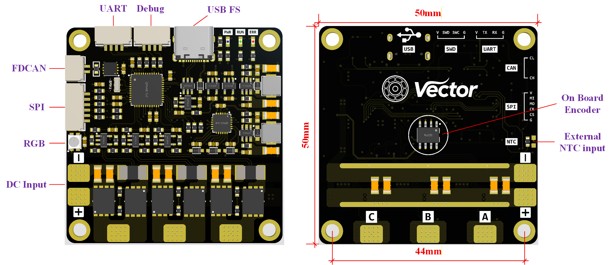

## 功能介绍

​        Vector 驱动器是一款中小型尺寸，基于矢量控制的永磁同步电机驱动，适用于轮毂电机，关节电机等。24V母线电压下，实测最高支持约400W的持续功率输入（需散热片）。内部算法可实现基础的电流，速度，位置闭环，同时具有一定的参数辨识能力。目前仅支持有感运行，板载了一块TLE5012B绝对式编码器，同时支持外部SPI编码器信号输入。通信外设提供了USB，UART，FDCAN三种，USB和FDCAN具备自主控制协议，USB FS 波特率12Mbps，可以通过VOFA+上位机以字符串的形式向下位机发送指令，即插即用。FDCAN数据段最高波特率5Mbps，可通过外部主控向总线发送报文以实现一对多控制。驱动器具有母线过压和欠压，相线过流，过温等保护，最大程度地保障驱动能够稳定运行。

## 硬件设计

### 1.元件选型

* MCU : **STM32G431CBU6**
* 栅极驱动 : **FD6288Q**
* MOSFET : **CSD18540Q5B** 
* 采样电阻 : **2mΩ** **2512封装**
* 电流感应放大器 : **RS721XF**
* 采样方案：**三电阻低侧采样**

### 2.整体布局

